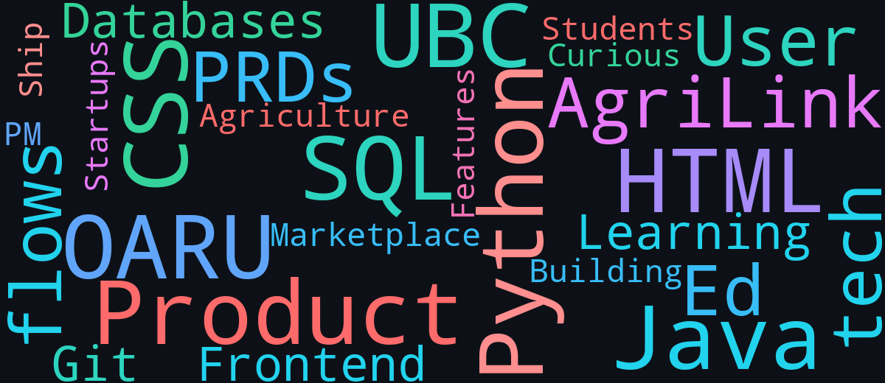

<!-- Hosted banner: shows in Cursor preview + on GitHub (local ./assets paths often don't preview) -->

  
  
  

---

I'm 3rd year student at **UBC** and I'm majoring in **Finance** — but I'm also a **self-taught coder** on the side. Huge shoutout to **Codecademy**, **Coursera**, and everyone else who helped me on this journey 😂

I'm still fairly new to programming and learning every week. Right now I'm most comfortable with **Python** and **SQL**. I also work with **HTML**, **CSS**, **Java**, **React**, and **Node.js**.

**Dream:** break into tech in a **product-focused role** — building things people actually want to use.

---

## What I'm working on

Over the past couple of years I've been focused on two projects:

### [OARU](https://oaru.ca) — *Optimize Academic Results Universally*
*Personal project · Jan 2026 – Present*

<li>Co-founded an ed-tech platform and led product work: PRDs, user flows, and feature prioritization to ship core functionality. Used **SQL** to help structure the database and organize data across schools.</li>

### AgriLink
*School project · Jan 2025 – Apr 2026*

<li>Led as product manager for an agriculture-focused digital marketplace — platform vision, user needs, PRDs, and cross-functional delivery with a focus on usability for different user types.</li>

---

## Tools I'm learning

<li>Python & SQL</li>
<li>HTML / CSS</li>
<li>Java</li>
<li>React & Node.js</li>

  

---

## Community word cloud ☁️

Add a word and the cloud updates over time.

**[Add a word](https://github.com/aidancgibbons/aidancgibbons/issues/new?template=add-word.yml)** · *Prompt: What are you learning right now?*

  

---

Thanks for stopping by — always happy to connect, especially if you're into product, startups, or ed-tech.

📧 **aidangibbons09@gmail.com**
